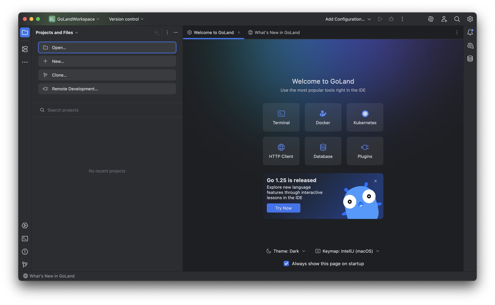

# 2.1 설치 방법

- 패키지 매니저 사용은 커뮤니티 배포판으로, 프로덕션 환경에서 특정 최신 버전이 필요할 때에는 공식 홈페이지에서 컴파일된 바이너리를 다운로드할 것

```bash

    brew install go

    go version go1.25.1 darwin/arm64

```

공식 최신 릴리스와 brew로 다운받은 버전이 동일하다. 깔끔한 관리를 좋아해서 일단 brew로 설치, 필요하다면 버전 관리 툴 `goenv`이나 `gvm`을 활용하기로 했다.

<br>

---

# 2.1.3 소스코드로 Go 빌드하기

- **Go 컴파일러(gc)**는 Go로 작성되었다.

- 새로운 버전의 Go 컴파일러는 이전 버전의 Go 컴파일러를 이용하여 작성(부트스트랩)한다. 이러한 방식의 gc를 정확히는 `Go 스펙`이라고 부른다.

- 또는 GNU C 컴파일러 프론트엔드인 `gccgo`를 사용하여 gc를 컴파일할 수 있다.

    - 성능에 민감한 경우 gccgo를 사용하는 게 유리할 수 있다. 예를 들어 일부 재귀 알고리즘을 사용할 때, gc는 tail call optimizzation을 지원하지 않아 느릴 수도 있다.

<br>

---

# (Optional) Go를 위한 IDE GoLand 설치하기

Jetbrains Student Package를 사용하고 있으므로, GoLand를 설치해보기로 했다.



타 IDE의 키 셋팅, 플러그인도 그대로 임포트 가능하다! 고퍼가 기욥다